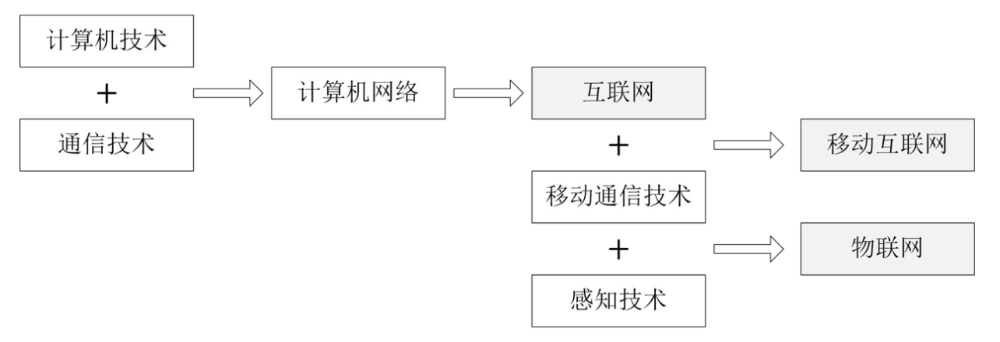
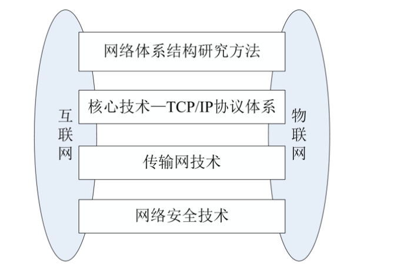

# CH-1 概论

## 1. CPS(Cyber-Physic Sys)主要技术特征

- CPS是 人、机、物 深度融合的系统
- CPS是 3C 与物理设备深度融合...
- CPS是 环境感知、嵌入式计算、网络通信

## 2. CPS与物联网的关系

- CPS研究的目标与物联网未来发展方向是一致的。CPS与物联 网所催生的智能技术与设备、协同工作体系、柔性化生产方式、精细化管理模式，将重塑现代产业体系的新格局
- CPS因控制技术与信息技术融合而起，将随着物联网在各行各业的应用，智能工业、智能农业、智能医疗的应用而迅速发展
- CPS理论研究与技术研究的成果，对物联网未来的发展有着重要的启示与指导作用

## 3. 物联网的定义
> **按照规定的协议，将具有“感知、通信、 计算”功能的智能物体、系统、信息资源 互联起来，  
> 实现对物理世界“ `泛在感知`、`可靠传输`、`智慧处理` ”的智能服务系统**

## 4. 理解物联网的定义与技术特征需要注意的问题:

- 物联网是在互联网基础上发展起来的，它与互联网在 基础设施上有一定程度的重合，但是它不是互联网概 念、技术与应用的简单扩展
- 互联网扩大了人与人之间信息共享的深度与广度，物 联网更加强调它在人类社会生活的各个方面、国民经 济的各个领域广泛与深入地应用
- 物联网主要特征是:泛在感知、可靠传输、智慧处理

## 5. **`物联网的主要技术特征`**

- **物联网的智能物体具有感知、通信与计算能力**
- **物联网可以提供所有对象在任何时间、任何地点的互联**
- **物联网的目标是实现物理世界与信息世界的融合**
## 6. 物联网与互联网的比较
### 6.1 物联网与互联网的相通之处

- 从计算机网络到互联网、移动互联网、物联网

- 技术与产业 的传承

### 6.2 不同

1. 物联网提供行业性、专业性与区域性的服务
    - 互联网提供全球性公共信息服务
2. 物联网数据主要是通过自动方式获取的
    - 互联网数据 - 人工方式生成
3. 物联网是可反馈、可控制的“闭环”系统

## 7. **`物联网关键技术包括的基本内容`**

- **感知技术**
- **嵌入式计算**
- **网络与通信**
- **位置服务**
- **智能技术**
- **软件技术**
- **系统规划与设计**
- **信息安全**

### 物联网关键技术及其涵盖的基本内容
1. 感知技术
   - RFID标签选型与读写器设计
   - 传感器的选型与传感器节点结构设计 
   - 传感网的设计与实现
   - 中间件与数据处理软件的设计与实现 

2. 嵌入式技术
   - 专用芯片设计制造
   - 嵌入式硬件结构设计与实现
   - 嵌入式操作系统
   - 嵌入式应用软件

3. 无线通信技术
   - 无线通信技术的选型
   - 无线通信网络系统设计
   - M2M协议与应用

4. 网络技术
   - 网络技术选型
   - 网络结构设计
   - 异构网络互联
   - 异构网络管理

5. 智能处理技术
   - 中间件与应用软件 
   - 海量数据存储与搜索 
   - 数据融合与知识发现 
   - 智能决策 

6. 控制技术
   - 环境感知
   - 信息融合
   - 规划与决策
   - 智能控制 

7. 定位技术
   - 位置信息
   - 定位技术
   - 位置服务 

8. 信息安全技术
   - 感知层安全
   - 传输层安全
   - 应用层安全
   - 隐私保护

## 8. 小结

- 物联网的发展具有深厚的社会与技术发展背景。全球信息化为物联网 的发展提供了原动力;信息学科三大支柱—计算、通信和感知的融合， 为物联网的发展奠定了理论基础;普适计算与信息物理融合系统 (CPS)的研究为物联网技术研究与产业发展指出了方向

- 物联网向我们描述了世界上的万事万物，在任何时间、任何地点都可 以方便地实现“人-机-物”融合的发展前景.物联网将推动计算、通信、 感知、智能、数据科学与社会各行各业在更广范围、更深层次的交叉 融合

- 物联网是我国战略性新兴产业的重要组成部分，是未来科技竞争的制 高点;物联网不仅与国民经济与社会发展息息相关，与提高人民生活 水平密不可分，也是我国创新驱动发展战略的重要体现

---
## 教材内容
### 1.1.1 物联网概念的提出
- 就是历史故事...看书吧

### 1.3.1 物联网的定义
- 3个基本问题
  - IoT在互联网基础上发展起来, 基础设施有一定程度重合, 但不是互联网的概念、技术、应用的简单扩展
  - 互联网扩大了信息共享的深度、广度, 而物联网更加强调在人类社会生活各方面、国民经济各领域广泛、深入的应用
  - ==**`IoT主要特征(前面有)`**==
    - `全面感知`
    - `可靠传输`
    - `智能处理`

### 1.3.2 **物联网的主要技术特征**
- (前面也有...)
  - **物联网的智能物体具有感知、通信与计算能力**
  - **物联网可以提供所有对象在任何时间、任何地点的互联**
  - **物联网的目标是实现物理世界与信息世界的融合**

### 1.4 物联网体系结构
- (太笼统了, 不好概括, 看书吧...)
- 物联网体系结构模型
  - 物联网感知层
  - 物联网网络层
  - 物联网应用层

### 1.5.1 物联网关键技术
- (这个前面不是也有么...)