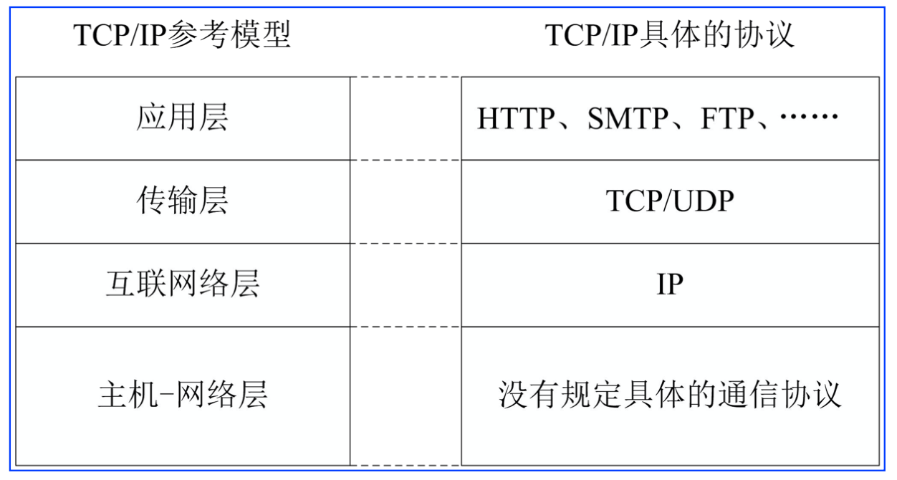

# CH-5 网络与通信

## 1. TCP/IP协议的基本概念 
1. TCP/IP协议的特点
- 开放的协议标准，独立于特定的计算机硬件与操作系统，独立于特定的网络硬件，
- 可以运行在局域网、广域网等各种传输网之上，
- 适用于互联网与物联网

TCP/IP参考模型与对应层次的协议

2. TCP与UDP协议提供的服务 
    1. TCP协议的特点
        - **可靠的面向连接服务**:
          - 在应用层数据传输之前，必须在通信 的与目的程序进程之间建立一个TCP连接;当一次进程通信 结束后，TCP协议关闭这个连接;面向连接传输的每一个报 文都需接收方确认
        - **面向字节流的传输服务**:
          - 流(stream)相当于一个管道，从 一端放入什么的字节流，从另一端可以照原样取出什么的字节流;TCP协议对正确接收到的字节行确认，出错时要求发送方重传
        - **TCP支持数据全双工通信**:
          - 两个应用程序进程可以同时利用 该连接发送和接收数据报文。双方通过捎带确认的方法交互 准确接收数据报的信息
    2. UDP协议的特点
        - **无连接服务**:
          - UDP协议相对比较简单，两个通信的进 程之间传输之前不建立连接，因此通过UDP协议不能 保证发送的报文按顺序到达
        - **不提供拥塞控制机制**:
          - UDP协议不提供拥塞控制机制， 发送进程可以用任意的速率发送报文，以提高报文传 输的实时性
        - TCP协议适用于对数据传输可靠性要求较高的网络应用，UDP协议适用于对数据传输实时性要求较高的网络应用
    3. 实时传输协议与容迟网研究
        - 实时传输协议RTP与实时传输控制协议RTCP的研究
            - 视频传输可以分为:
              - 非实时的视频传输
              - 实时视频传输
        - 容迟网技术的研究
            - 物联网很多应用都不能保证满足TCP“持续”连接的要求，学术界将这类网络称之为“受限网络”
            - 针对受限网络，研究人员提出“容迟网(DTN)”的 研究，修改了传统的TCP/IP的体系结构与传输机制，以适应物联网中对传输层的“长延时、间歇性连接、低信噪比与高误码率”的应用需求

## 2. 5G与物联网 
- 5G性能指标
  - 用户体验速率
  - 流量密度
  - 连接数密度
  - 端-端延时
  - 移动性
  - 用户峰值速率

- 5G与物联网
  - 5G网络作为面向2020年的技术，需要满足移动宽带、物联网，以及其他高可靠通信要求，同时它也是一个智能化的网络;5G网 络具有自检修、自配置与自管理的能力
  - 5G的设计者将物联网纳入到整个技术体系 之中，5G技术的发展与应用将大大推动物联网“万物互联”的发展

## 3. ZigBee技术的基本概念
- ZigBee是一种面向自动控制的低速、低功耗、低价格的无线网络技术，ZigBee网络的结点数量、覆盖规模 大
- 在ISM的 2.4GHz频道，传输速率为250kbps;在 915Mbps为40kbps;功耗低，节点在不更换电池的情 况下可以工作长达几年;传输距离为10~75m
- 适应于数据采集与控制的点多、数据传输量不大、覆盖面广、造价低的应用领域，如家庭网络、安全监控、 医疗保健、工业控制、无线定位等

## 4. NB-IoT
> NB-IoT全称是“基于蜂窝网络的窄带物联网 (Narrow Band Internet of Things)”
- NB-IoT研究的目标瞄准的物联网市场。NB-IoT标准是由华 为公司主导制定，技术的主要特点是:广覆盖、大规模、低 功耗、低成本
- “广覆盖、大容量”表现在NB-IoT构建于蜂窝移动通信网 中，只消耗大约180KHz的带宽，单个小区支持10万个移动 终端接入
- “低功耗、低成本”表现在NB-IoT终端模块的待机时间可 长达10年，终端模块的成本很低

## 5. 小结
- 计算机网络是计算机学科最活跃的一个研究领域，互联网是计算机 网络最成功的应用，移动通信产业为信息产业的发展注入了强劲的 动力，正在改变着人们的社会生活与经济社会
- 研究物联网通信与网络技术，必须了解计算机网络与广域网、城域 网、局域网、个人区域网与人体区域网的基本知识
- 物联网将成为5G技术研究与发展的重要推动力，同时5G技术的成熟 和应用也将使很多物联网应用的带宽、可靠性与延时的瓶颈达到解 决
- 物联网的发展不断向移动通信网提出新的研究课题与应用需求，促 进着移动通信网技术的发展，M2M、NB-IoT技术就是很好的例证
- 物联网接入技术关系到如何将成千上万的传感器、控制器与智能终 端设备接入到物联网应用系统，也是组建物联网网络基础设施中需 要解决的一个重要问题
