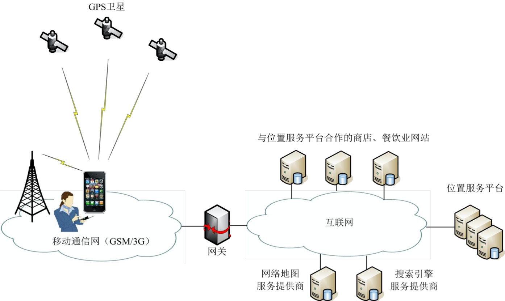

# CH-6 位置信息

## 1. 位置服务基本概念

- 基于位置的服务 Location Based Service，LBS

## 2. GPS系统的组成
- 空间星座部分
- 地面监控部分
  - 主控站
  - 注入站
- 用户设备部分

## 3. 【查资料】常用的室内定位技术有哪些?
- 超声波技术
- 蓝牙（iBeacon）定位技术
- 超宽带技术
- 红外线技术

## 4. 小结
- 位置信息是各种物联网应用系统能够实现服务功能的基础. 位置信息涵盖了空间、时间与对象三要素
- GPS是将卫星定位和导航技术与现代通信技术相结合，具有全时空、全天候、高精度、连续实时地提供导航、定位和授时的特点
- 我国的北斗卫星导航系统具有“定位、导航、通信与授时”等 四大功能，已成功应用于测绘、电信、水利、渔业、交通运输、 森林防火、减灾救灾和公共安全等领域
- 物联网定位技术还包括移动通信定位技术、基于无线局域网的定位技术、基于RFID的定位技术与无线传感器网络定位技术
- 随着智能手机、可穿戴计算设备与物联网移动终端设备应用的发展，位置服务迅速地流行开来，位置服务已经成为信息服务业一种新的服务模式与经济增长点

---

## 教材内容(移动通信技术)
### 6.1.1 通信的基本概念
### 6.1.2 无线通信技术的发展
### 6.2.4 移动通信系统的结构 & 基本工作原理